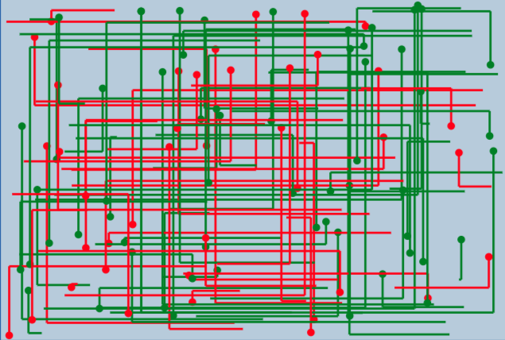

# HashCode2018
Hash Code Solution implemented in Scala. Purely functional code.

Statement: [Here](statement.pdf)

Total Score: **15.264.837**




## Run

```shell
scala main.scala {input} {output}
```


## Authors

[Álvaro García Jaén](https://github.com/AlvaroGarciaJaen)

[Antonio Molner Domenech](https://github.com/antoniomdk)

[Fran González](https://github.com/Neo-Stark)

[Ignacio Martínez Rodríguez](https://github.com/igna1998)


